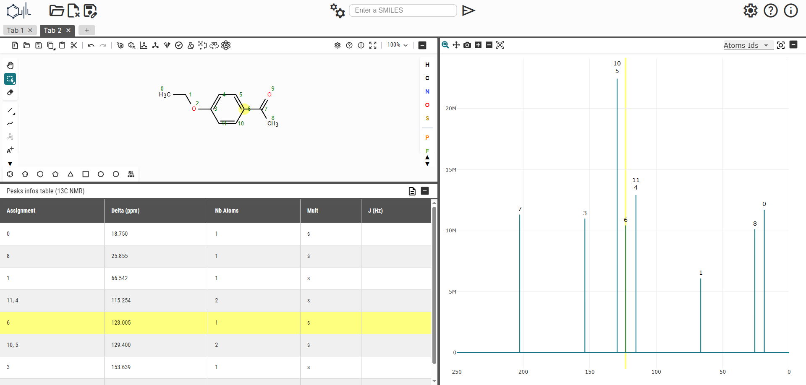
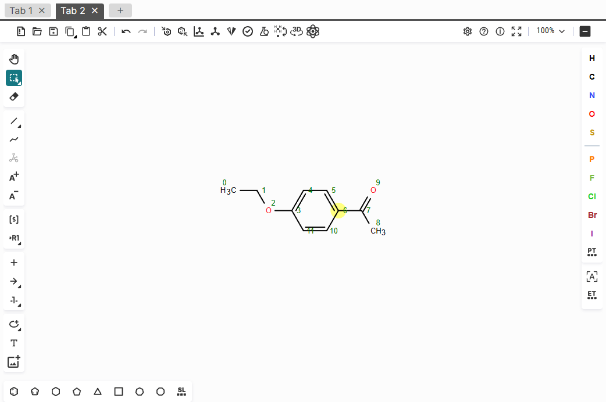
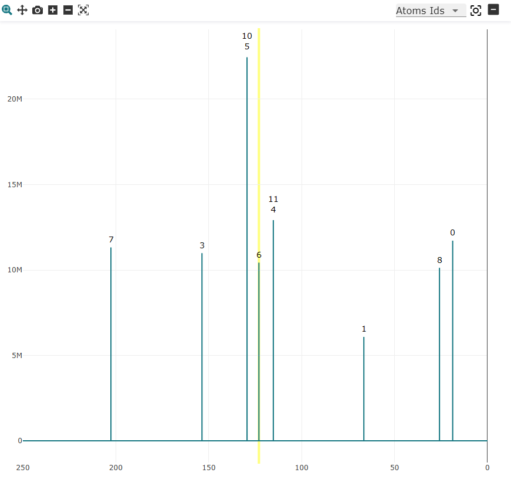

# PredictionRMN – User Guide

**Last update: July 3, 2025**

**Author: [Yamis MANFALOTI](https://github.com/KreeZeG123)**

**GitHub Project**: [https://github.com/BenoitDamota/PredictionRMN](https://github.com/BenoitDamota/PredictionRMN)

**Frontend (Custom Ketcher)**: [https://github.com/BenoitDamota/CustomKetcher](https://github.com/BenoitDamota/CustomKetcher)

## 📦 Installation & Launch

You can either:

- Download and use the packaged application found in the release section

- Or launch from the sources :

  **In a terminal :**

  ```bash
  # Reach the backend folder from root
  cd backend

  # If needed, create a python virtual environment
  python -m venv venv              # or "python3 -m venv venv"
  source venv/bin/activate         # For Linux or Mac
  venv\Scripts\activate            # For Windows

  # Install all depedencies
  pip install -r requirements.txt

  # Launch the app
  python app.py

  # Then a page should be oppened in your Web Browser
  # Or else, the page link is in the terminal
  ```

## 🎯 Purpose

**PredictionRMN** is a web-based application for chemists that allows:

- Drawing molecular structures
- Predicting NMR spectra
- Visualizing and analyzing chemical shifts
- Visualizing association between atoms and NMR peaks
- Exporting annotated spectra and molecular images
- Managing multiple projects in tabs

## 🖥 Interface Overview



### 🔧 Toolbar

Contains quick access buttons for common actions such as project management, exporting, and toggling display options.

### 🧪 Molecule Editor

The molecule editor is based on **Ketcher**, a widely used chemical structure editor.

📎 **Note:** We recommend reading [Ketcher’s official documentation](https://github.com/epam/ketcher/blob/v3.1.0/documentation/help.md#ketcher-overview) for an in-depth understanding of the features.

### 📈 Spectrum Vizualizer

Displays predicted or imported NMR spectra with interactive zooming, peak inspection, and annotation capabilities.

### 📋 NRM Peaks Infos Table

Shows detailed numerical data about detected NMR peaks, including atoms assignements, chemical shiftsn multiplicities and couplings.

## ⚙️ Functional Overview

### 📂 Project Management


- **Open project** (📁 icon): Load `.json` or `.jdx` files.

  - Supports JCAMP-DX spectra with x-axis in `ppm` or `Hz`.
  - Compressed JCAMP-DX formats may load but without decompression of intermediate points.

- **Clear project** (📄 icon): Clear all data of the current project.

- **Export** (💾 icon):

  - Export the current project as a `.json`
  - Export the spectrum as an **image** with the selected annotation
  - Export the molecule as an **image** with the atoms IDs
  - Export a **ZIP archive** containing:
    - JSON project file
    - Spectrum image with annotations
    - Molecule image with atom IDs via RDKit

### 🧠 Prediction


- **Model parameters** (⚙️):

  - Choose parameters values for each prediction models
  - Customize or add your own prediction model via **select model > manage models**

- **SMILES input bar** (⌨️):

  - You can write a SMILES in the input bar to launch a prediction from it
  - Pressing ENTER when writing in the input bar draw the corresponding molecule in Ketcher

- **Send button** (▶): Launches a prediction based on:

  - The structure drawn in Ketcher
  - Or the SMILES in the input field (priority)
    > If a SMILES in the input field is present, a warning asks for confirmation (can be disabled).

- **Prediction latency**:

  - To handle the response time from a prediction model, at the start of a prediction, a new tab is oppened and wait for the results
  - A message is shown to remind you when a tab received the prediction results\*

### 🛠 Settings, Help and Info


General settings are accessible via the gear icon (⚙️) on the top right :

- Manage general application settings
- Restore saved parameters to the configured default values
- Factory reset to restore the initial general settings and prediction parameters

The Help button redirecte to this documentation

And the Info button show the informations about the application

### 🧭 Tab Management

- Each project opens in a **separate tab**

- New tabs created when:

  - Opening a file
  - Launching a prediction
  - Clicking the "new tab" button (➕)

- A confirmation is requested when closing a tab containing data

### 🧪 Ketcher



The molecule editor is powered by **Ketcher**, an intuitive editor for chemical structures.

Key features available in the application:

- 🧱 **Draw molecules** using bonds, atoms, rings, and templates
- 🔄 **Paste** SMILES to auto-generate structures
- ⚛️ **Show atom IDs** using the toolbar's atom icon or in `Settings > Options for Debugging > Show atom Ids`
- 🧹 **Reset atom layout** with `CTRL + L` or the Layout button
- 🖱️ **Select, edit, delete atoms and bonds**

- Atom IDs shown via:

  - Ketcher settings: `Ketcher > Settings > Options for Debugging > Show atom Ids`
  - Or directly via the "atom" icon in the toolbar

- To reset the atoms IDs use `CTRL + L` or Ketcher's **Layout** button

For advanced usage and features, refer to [Ketcher’s documentation](https://github.com/epam/ketcher/blob/v3.1.0/documentation/help.md#ketcher-overview)

### 📊 Spectrum



- Built using Plotly for zooming, selecting, and inspecting peaks.

- **Multiplicities support**: Multiplicities are grouped under a peak and labeled using `find_peaks` (SciPy) with intensity and ppm values.

- **Annotation options**:

  - None
  - Atom IDs
  - PPM of multiplicities

- **Mouse hover**: Highlights the closest peak.

- **Mouse click**:

  - Highlights atoms linked to that signal
  - If **auto-zoom** is enabled (⛶ icon), zooms into selected peak

### 📋 NMR Peaks Information Table


This panel displays detailed information about each NMR peak, including:

- Atoms assignements
- Chemical shift (ppm)
- Number of atoms
- Multiplicity (singlet, doublet, triplet, etc.)
- Couplings (in Hz)

Clicking on a row highlights the corresponding atoms in the molecule editor and the associated peaks in the spectrum visualizer, facilitating direct correlation between structure and spectral data.

The toolbar in this panel includes a 📄 **Inline Notation** button that display the **Inline NMR Notations** for those data.

## 💡 Tips & Known Issues

### ✅ Supported

- Loading JCAMP-DX possible when using an x-axis in ppm or Hz (converted to ppm if the observation frequency is found)
- Peak detection is even possible from spectrum data that does not contain data for the associations between atoms and NMR peaks

### ❌ Limitations

- JCAMP-DX compressed formats may not fully decode
- Thresholds for peak grouping are heuristic

## 📞 Feedback & Support

If you encounter unexpected behaviors, bugs, or have suggestions, please open an issue on the GitHub repo or contact the LERIA directly.
